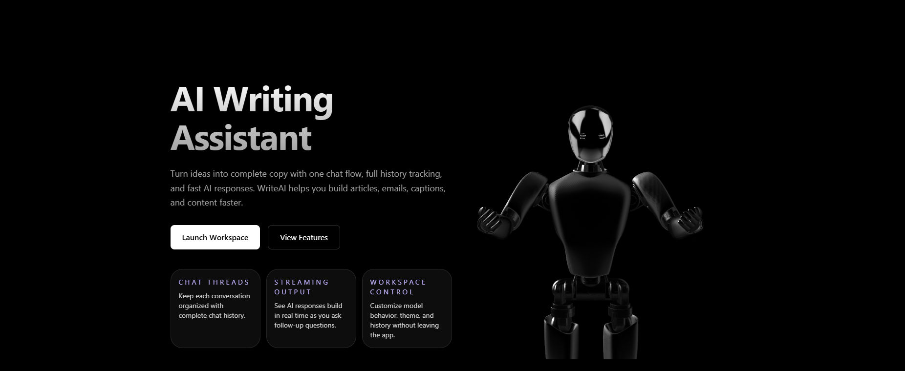
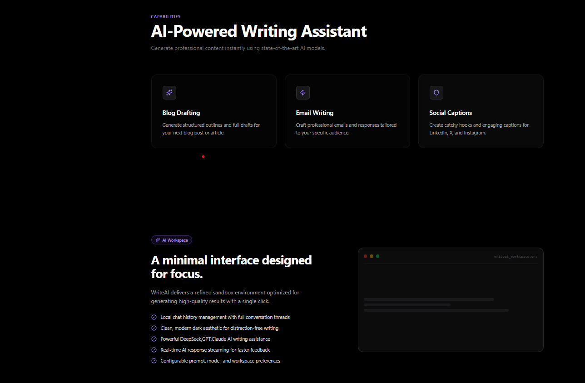
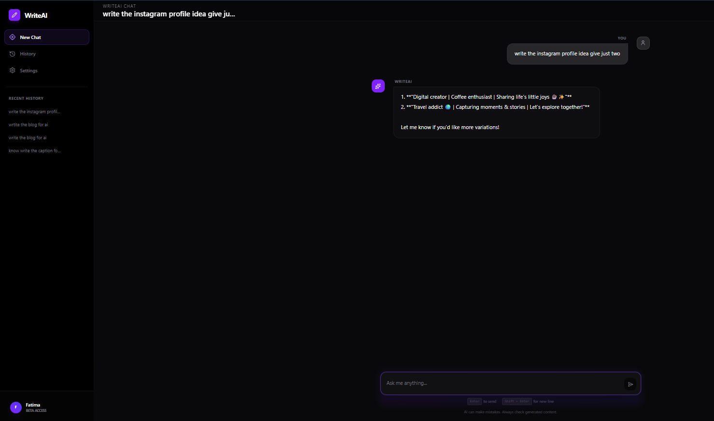
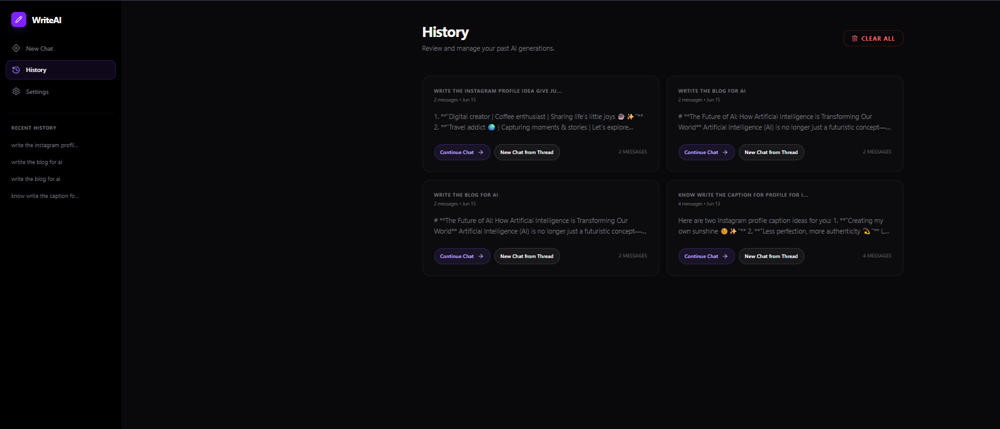
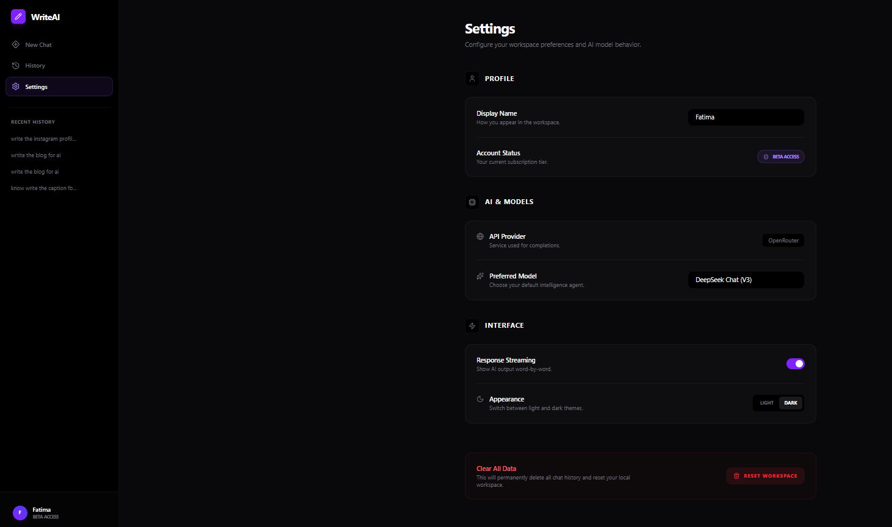

<div align="center">

# ✍️ WriteAI — AI-Powered Writing Assistant

**Generate professional content instantly.**  
Blogs, emails, captions, and creative copy — all in a clean, minimal AI workspace.

[](https://react.dev)
[](https://vitejs.dev)
[](https://tailwindcss.com)
[](https://openrouter.ai)
[](LICENSE)

<br/>



<br/>

[🚀 Live Demo](https://your-vercel-url.vercel.app) &nbsp;•&nbsp;
[📖 Docs](#-quick-start) &nbsp;•&nbsp;
[🐛 Report Bug](https://github.com/fatima-muzafar/-AI-Writing-Assistant-/issues) &nbsp;•&nbsp;
[✨ Request Feature](https://github.com/fatima-muzafar/-AI-Writing-Assistant-/issues)

</div>

---

## 📌 What is WriteAI?

WriteAI is a modern, **local-first** writing workspace powered by state-of-the-art language models via [OpenRouter](https://openrouter.ai). It gives you a distraction-free interface to draft, iterate, and refine content — without juggling browser tabs.

---

## ✨ Key Features

| Feature | Description |
|---|---|
| 🤖 **Multi-Model Support** | Switch between DeepSeek V3, GPT-4o-mini, and Claude 3.5 Haiku |
| ⚡ **Real-Time Streaming** | Watch AI responses build word-by-word |
| 💬 **Chat Threading** | Multi-turn conversations grouped in one place |
| 📜 **Smart History** | Search and resume past sessions instantly |
| 🎨 **Light / Dark Mode** | Toggle themes with one click |
| 🔒 **Local-First Privacy** | All data stays in your browser — nothing is synced to a server |
| 🔄 **Continue or Restart** | Resume any past conversation or spin up a fresh one |

---

## 📸 Screenshots

| | |
|---|---|
|  |  |
| **Landing Page** | **Chat Dashboard** |
|  |  |
| **Conversation History** | **Settings Panel** |

---

## 🛠️ Tech Stack

| Layer | Technology |
|---|---|
| **Frontend** | React 19.2, Vite 8.0 |
| **Styling** | TailwindCSS 4.3, Custom CSS Animations |
| **State** | React Context API + LocalStorage |
| **Routing** | React Router DOM v7 |
| **Icons** | Lucide React |
| **3D / Motion** | Spline, Framer Motion *(optional)* |
| **AI API** | OpenRouter (DeepSeek, GPT-4o-mini, Claude 3.5) |

---

## 🚀 Quick Start

### Prerequisites

- Node.js `16.x` or later
- An [OpenRouter API Key](https://openrouter.ai) *(free tier available)*

### 1. Clone & Install

```bash
git clone https://github.com/fatima-muzafar/-AI-Writing-Assistant-.git
cd -AI-Writing-Assistant-
npm install
```

### 2. Configure Environment

```bash
cp .env.example .env.local
```

Open `.env.local` and add your key:

```env
VITE_OPENROUTER_API_KEY=sk_live_your_key_here
```

### 3. Run Locally

```bash
npm run dev
# → http://localhost:5173
```

### 4. Build for Production

```bash
npm run build
npm run preview
```

---

## 📂 Project Structure

```
src/
├── pages/
│   ├── Home.jsx          # Landing page
│   ├── Dashboard.jsx     # Main chat interface
│   ├── History.jsx       # Conversation history
│   └── Settings.jsx      # User preferences
│
├── features/
│   └── ai-writer/
│       ├── components/
│       │   ├── Hero.jsx       # Landing hero section
│       │   ├── InputBox.jsx   # Chat input
│       │   └── OutputBox.jsx  # Message display
│       └── services/
│           └── aiService.js   # OpenRouter integration
│
├── components/
│   ├── layout/
│   │   └── Sidebar.jsx        # Nav + recent history
│   └── ui/                    # Reusable UI primitives
│
├── contexts/
│   └── SettingsContext.jsx    # Global settings
│
├── App.jsx                    # Router + providers
└── main.jsx                   # Entry point
```

---

## ⚙️ Configuration

All in-app settings are stored in your browser's LocalStorage — no account needed.

| Setting | Default | Options |
|---|---|---|
| **AI Model** | DeepSeek Chat V3 | DeepSeek, GPT-4o-mini, Claude 3.5 Haiku |
| **Streaming** | Enabled | On / Off |
| **Theme** | Dark | Light / Dark |
| **Display Name** | — | Any string |

---

## 🌐 Deployment

### Vercel *(Recommended)*

1. Push your repo to GitHub
2. Import at [vercel.com/new](https://vercel.com/new)
3. Add environment variable:
   ```
   VITE_OPENROUTER_API_KEY = sk_live_...
   ```
4. Click **Deploy**

### Netlify

1. Connect repo to [Netlify](https://netlify.com)
2. Build command: `npm run build`
3. Publish directory: `dist`
4. Add the same environment variable → Deploy

---

## 🐛 Troubleshooting

<details>
<summary><b>API key not working</b></summary>

- Confirm the key is in `.env.local` (not `.env`)
- Variable must start with `VITE_` to be exposed to the client
- Check your [OpenRouter dashboard](https://openrouter.ai) for credit balance

</details>

<details>
<summary><b>Streaming not working</b></summary>

- Go to **Settings → Response Streaming → Enable**
- Check browser console for API errors
- All supported models have streaming enabled by default

</details>

<details>
<summary><b>History not saving</b></summary>

- Ensure your browser allows LocalStorage (not in incognito/private mode by default)
- History is device-specific — it won't sync across browsers

</details>

<details>
<summary><b>Build errors</b></summary>

```bash
rm -rf node_modules package-lock.json
npm install
npm run build
```

Ensure Node.js is `16.x` or higher: `node -v`

</details>

---

## 🤝 Contributing

Contributions are welcome.

```bash
# 1. Fork the repo
# 2. Create your branch
git checkout -b feature/your-feature-name

# 3. Commit your changes
git commit -m "feat: add your feature"

# 4. Push and open a PR
git push origin feature/your-feature-name
```

Please open an issue first for major changes.

---

## 📄 License

MIT — free for personal and commercial use. See [LICENSE](LICENSE).

---

<div align="center">

**Built by [Fatima Muzafar](https://github.com/fatima-muzafar)**

*If this project helped you, consider leaving a ⭐*

</div>

